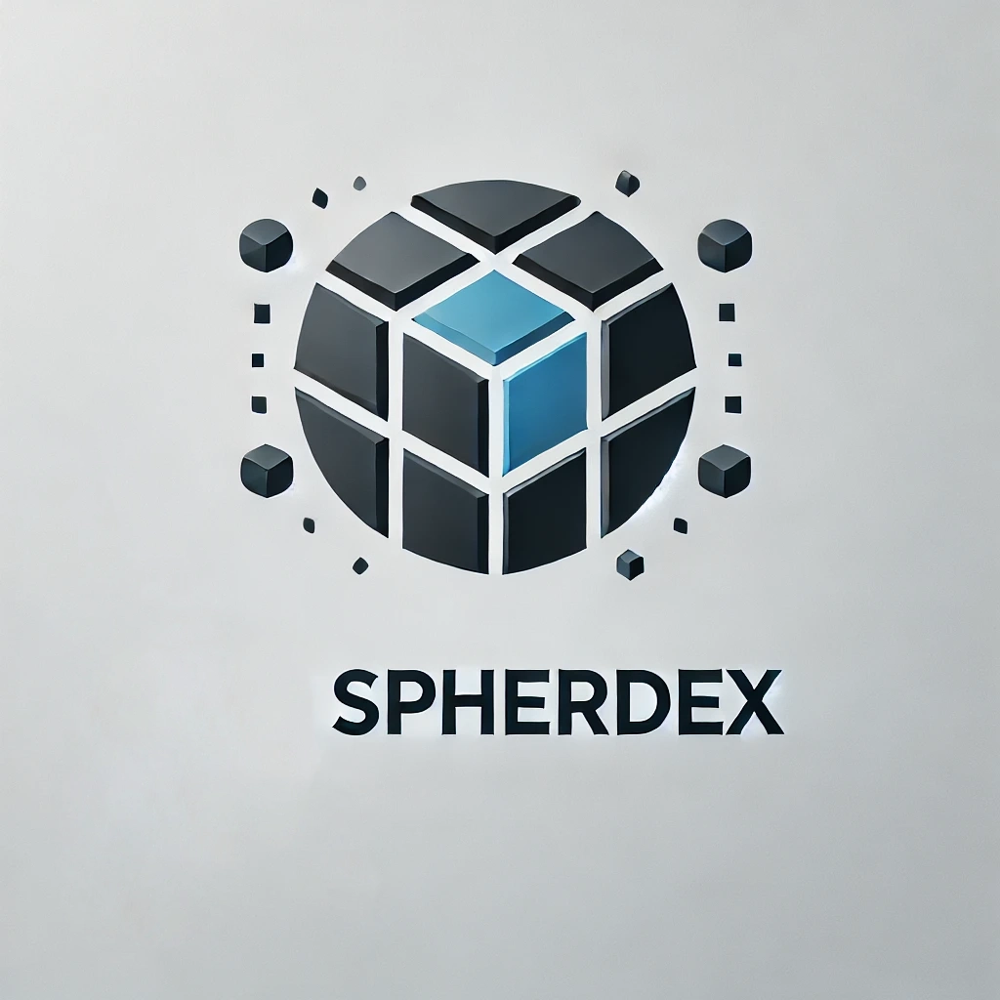

# 📘 Spherdex – Handbuch

**Willkommen zur offiziellen Dokumentation von Spherdex!** 🚀  

Spherdex ist eine leistungsstarke Mitgliederverwaltungssoftware für Vereine und Verbände. Diese Dokumentation hilft dir dabei, Spherdex effizient zu nutzen, von der Installation bis hin zur täglichen Anwendung.  

---

## 📌 Was ist Spherdex?

Spherdex wurde speziell für die Verwaltung von Mitgliedern, Beiträgen, Veranstaltungen und internen Abläufen in Vereinen und Organisationen entwickelt. Es basiert auf **Frappe v15 & ERPNext v15** und bietet eine **moderne, intuitive Benutzeroberfläche**.  

### 🌟 Hauptfunktionen  

✅ **Mitgliederverwaltung:** Erfasse und verwalte Mitglieder, inklusive Kontaktdaten & Zahlungsstatus.  
✅ **Beitragsmanagement:** Automatisierte Verwaltung von Mitgliedsbeiträgen & Rechnungen.  
✅ **Veranstaltungsplanung:** Organisiere Events, Tracke Anmeldungen & Teilnahme.  
✅ **Dokumentenmanagement:** Speichere & verwalte wichtige Vereinsdokumente direkt in Spherdex.  
✅ **Benutzerfreundlich:** Einfache Navigation und Integration in bestehende Systeme.  

---

## 🚀 Erste Schritte

📂 **Installation:** [Hier klicken](installation.md)  
🖥 **Grundlegende Nutzung:** [Hier klicken](usage.md)  
🔄 **FAQ & Fehlerbehebung:** [Hier klicken](faq.md)  

Dieses Handbuch wird regelmäßig aktualisiert. Falls du Fragen hast oder Feedback geben möchtest, melde dich gerne über unser [GitHub-Repository](https://github.com/Terranom674/spherdex).  

**Viel Erfolg mit Spherdex!** 🎉
